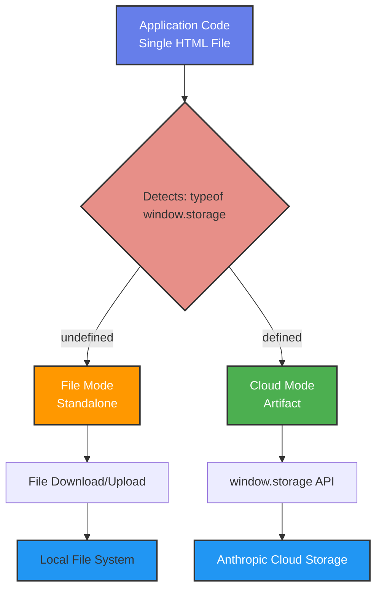

# Claude Artifact Adaptive Storage Demo

[](https://developer.mozilla.org/en-US/docs/Web/Guide/HTML/HTML5)
[](https://developer.mozilla.org/en-US/docs/Web/JavaScript)
[](https://claude.ai)

A demonstration of building web applications that automatically adapt their persistence strategy based on the runtime environment - seamlessly using Claude's cloud storage when running as a published artifact, or falling back to traditional file-based persistence when running standalone.

## What This Demonstrates

This simple notes application showcases a powerful pattern for building portable web apps that work both as Claude artifacts with cloud persistence and as standalone HTML files:

- **Environment Detection**: Automatically detects whether running as a Claude artifact or standalone
- **Adaptive Persistence**: Seamlessly switches between cloud storage and file downloads
- **Single Codebase**: One set of code that works in both environments
- **Zero Configuration**: No user configuration needed - it just works

## The Problem This Solves

When building web applications, you often face a choice:

1. **Cloud-based apps**: Great UX with automatic persistence, but tied to a specific platform
2. **Standalone apps**: Portable and self-contained, but require manual save/load workflows

This demo shows you can have **both** - a single application that adapts to its environment.

## How It Works

### Environment Detection

The app detects its runtime environment by checking for the `window.storage` API:

```javascript
const hasCloudStorage = typeof window.storage !== 'undefined';
```

- If `window.storage` exists → Running as Claude artifact
- If `window.storage` is undefined → Running as standalone HTML

### Adaptive Behavior

Based on the detected environment, the app automatically adjusts:

#### Cloud Mode (Claude Artifact)
- ✅ Auto-saves to Anthropic's cloud storage
- ✅ Data persists across sessions and devices
- ✅ No manual file management needed
- ✅ One-click save and load

```javascript
async function saveToCloud(text) {
    const data = { content: text, saved: new Date().toISOString() };
    await window.storage.set('notes:data', JSON.stringify(data), false);
}

async function loadFromCloud() {
    const result = await window.storage.get('notes:data', false);
    const data = JSON.parse(result.value);
    return data.content;
}
```

#### File Mode (Standalone)
- 💾 Downloads notes as JSON file
- 📁 Upload previously saved files to restore
- 🔓 Works anywhere - no account needed
- 🌐 Share the HTML file with anyone

```javascript
function saveToFile(text) {
    const data = { content: text, saved: new Date().toISOString() };
    const blob = new Blob([JSON.stringify(data, null, 2)], { type: 'application/json' });
    const url = URL.createObjectURL(blob);
    const a = document.createElement('a');
    a.href = url;
    a.download = 'notes-' + Date.now() + '.json';
    a.click();
    URL.revokeObjectURL(url);
}
```

### Screenshots

| Cloud Mode (Artifact) | File Mode (Standalone) |
|----------------------|------------------------|
|  |  |
| Auto-saves to Anthropic cloud storage | Downloads/uploads JSON files |


## Claude Artifact Storage API

### Overview

Claude artifacts (published on claude.ai) have access to a persistent storage API with these characteristics:

- **Storage Limit**: 20MB per artifact
- **Data Type**: Text-only (JSON, strings, base64-encoded binary)
- **Isolation**: Personal and shared storage are separate
- **Lifecycle**: Data deleted when artifact is unpublished

### Personal vs Shared Storage

The third parameter in storage methods determines visibility:

#### Personal Storage (`false`)
Each user maintains their own private data:

```javascript
// Save - only this user can see this data
await window.storage.set('user:notes', jsonData, false);
//                                                 ^^^^^
//                                                 false = personal

// Load - retrieves only this user's data
const result = await window.storage.get('user:notes', false);
```

**Use cases:**
- Personal journals and notes
- Individual user preferences
- Private task lists
- Personal analytics

#### Shared Storage (`true`)
All users see and interact with the same data:

```javascript
// Save - all users will see this data
await window.storage.set('game:leaderboard', jsonData, true);
//                                                      ^^^^
//                                                      true = shared

// Load - retrieves data shared by all users
const result = await window.storage.get('game:leaderboard', true);
```

**Use cases:**
- Collaborative whiteboards
- Game leaderboards
- Shared todo lists
- Team brainstorming tools

⚠️ **Privacy Warning**: When building artifacts, the creator (developer) chooses whether data is personal or shared. End users cannot change this setting. Always consider whether sensitive data should use shared storage.

### Complete API Reference

```javascript
// SET - Store data
await window.storage.set(key, value, isShared);
// key: string (max 200 chars, no spaces/slashes)
// value: string (max 5MB per key)
// isShared: boolean (true = shared, false = personal)

// GET - Retrieve data
const result = await window.storage.get(key, isShared);
// Returns: { value: string }
// Throws error if key doesn't exist

// DELETE - Remove data
await window.storage.delete(key, isShared);

// LIST - Get all keys matching a prefix
const result = await window.storage.list(prefix, isShared);
// Returns: { keys: string[] }
```

### Storage Specifications

| Specification | Limit |
|--------------|-------|
| Total storage per artifact | 20MB |
| Maximum key length | 200 characters |
| Maximum value size | 5MB |
| Rate limit | 100 non-cached requests/hour |
| Supported data types | Text only (JSON, strings, base64) |
| Key restrictions | No spaces or slashes |

### Advanced Pattern: Hierarchical Keys

Organize related data using prefixed keys:

```javascript
// Store related items with a common prefix
await window.storage.set('tasks:task_001', taskData, false);
await window.storage.set('tasks:task_002', taskData, false);
await window.storage.set('tasks:task_003', taskData, false);

// List all task keys
const result = await window.storage.list('tasks:', false);
// Returns: { keys: ['tasks:task_001', 'tasks:task_002', 'tasks:task_003'] }

// Load all tasks
const tasks = await Promise.all(
    result.keys.map(key => window.storage.get(key, false))
);
```

### Storing Binary Data

While the API only accepts text, you can store binary data using base64 encoding:

```javascript
// Encode binary data to base64
const binaryData = new Uint8Array([...]); // Your binary data
const base64String = btoa(String.fromCharCode(...binaryData));

// Store as text
await window.storage.set('binary:data', base64String, false);

// Retrieve and decode
const result = await window.storage.get('binary:data', false);
const decoded = Uint8Array.from(atob(result.value), c => c.charCodeAt(0));
```

**Note**: Base64 encoding increases size by ~33%, so 20MB storage becomes ~15MB of actual binary data.

## Usage Scenarios

### Scenario 1: Personal Productivity Tool (You)

1. Publish the artifact on Claude.ai
2. Use it with seamless cloud persistence
3. Access from any device with your Claude account
4. Your data automatically syncs

### Scenario 2: Sharing with Others (File Mode)

1. Download the HTML file
2. Email or share via cloud storage
3. Recipients open in any browser
4. They use file-based save/load
5. No Claude account required

### Scenario 3: Hybrid Approach

1. Use as published artifact for yourself (cloud mode)
2. Keep a downloaded copy as backup (file mode)
3. Share the HTML with collaborators who don't have Claude
4. Everyone can use the tool in the way that works for them

## Platform Requirements

### To Use as Claude Artifact (Cloud Mode)
- Claude account (Pro, Max, Team, or Enterprise plan)
- Access to claude.ai or Claude Desktop
- Artifact must be published

### To Use Standalone (File Mode)
- Any modern web browser
- No account required
- Works offline

## Getting Started

### Option 1: Use as Published Artifact

1. Open the HTML file in Claude.ai chat
2. Ask Claude to publish it as an artifact
3. The artifact will automatically use cloud storage
4. Start using - your data persists automatically

### Option 2: Use as Standalone HTML

1. Download `claude-adaptive-saving-notes.html`
2. Open in any web browser
3. Type your notes
4. Click "Save" to download a JSON file
5. Click "Load" to upload and restore from a saved file

## Technical Architecture



## Code Pattern for Your Own Apps

This pattern can be applied to any web application:

```javascript
// 1. Detect environment
const isClaudeArtifact = typeof window.storage !== 'undefined';

// 2. Initialize UI based on environment
function initializeApp() {
    if (isClaudeArtifact) {
        showCloudModeUI();
        autoLoadFromCloud();
    } else {
        showFileModeUI();
    }
}

// 3. Adaptive save function
async function saveData(data) {
    if (isClaudeArtifact) {
        await window.storage.set('app:data', JSON.stringify(data), false);
    } else {
        downloadAsFile(data);
    }
}

// 4. Adaptive load function
async function loadData() {
    if (isClaudeArtifact) {
        return await loadFromCloud();
    } else {
        return await uploadFile();
    }
}
```

## Benefits of This Approach

### For Developers
- ✅ Write once, run anywhere
- ✅ No backend infrastructure needed
- ✅ Easy to test (just open the HTML file)
- ✅ Simple deployment (publish or share file)

### For Users
- ✅ Seamless experience in Claude artifacts
- ✅ No forced cloud dependency
- ✅ Can share with non-Claude users
- ✅ Works offline when needed

### For Organizations
- ✅ Rapid prototyping without infrastructure
- ✅ Internal tools with cloud convenience
- ✅ External sharing without platform lock-in
- ✅ Cost-effective (no server costs)

## Limitations and Considerations

### Cloud Storage Limitations
- **Account Required**: Claude Pro/Max/Team/Enterprise needed
- **20MB Limit**: Per artifact
- **No Official Backups**: Export critical data periodically
- **Platform Lock-in**: Data lives on Anthropic servers
- **Unpublishing Deletes Data**: Permanent, no recovery

### File Mode Limitations
- **Manual Process**: User must save/load explicitly
- **No Auto-sync**: Each browser session is isolated
- **Easy to Forget**: Users might forget to save

### General Limitations
- **Text Only**: Binary data requires base64 encoding
- **Rate Limits**: 100 non-cached requests/hour for cloud storage
- **Browser Restrictions**: File mode can't auto-save (requires user action)

## Future Enhancements

Possible improvements to explore:

- **Auto-save timer** in cloud mode
- **Conflict detection** for shared storage
- **Export/import** in cloud mode (backup mechanism)
- **Multiple file support** in file mode
- **Encryption** for sensitive data
- **Version history** tracking
- **Collaborative editing** indicators

## Use Cases for This Pattern

This adaptive storage pattern is ideal for:

### Personal Tools
- Note-taking apps
- Todo lists
- Habit trackers
- Journals
- Budget trackers

### Prototypes
- Quick demos without backend
- User testing tools
- Proof-of-concept apps
- Internal utilities

### Educational Apps
- Interactive tutorials that save progress
- Learning tools with checkpoints
- Student assignment templates
- Code sandboxes

### Collaborative Tools
- Brainstorming boards
- Shared whiteboards
- Team voting tools
- Game scoreboards

## License

This is a demonstration project. Feel free to use, modify, and distribute as needed.

## Related Resources

## Related Resources

- [Claude Artifacts Documentation](https://support.claude.com/en/articles/9487310-what-are-artifacts-and-how-do-i-use-them)
- [Anthropic Claude](https://claude.ai)
- [File API (for file mode)](https://developer.mozilla.org/en-US/docs/Web/API/File_API)
- [Blob API (for downloads)](https://developer.mozilla.org/en-US/docs/Web/API/Blob)
  
---

**Built with Claude Sonnet 4.5** - Demonstrating adaptive persistence patterns for modern web applications.
